# RegWatch: Automated Regulatory Monitoring & AI Analysis

RegWatch is a flexible and automated regulatory monitoring and analysis tool. It automates the task of tracking updates from various public websites, RSS feeds, and APIs, analyzing their contents using Large Language Models (LLMs), and delivering structured reports directly to subscribers.

---

## Architecture & Data Flow

RegWatch uses a clean, modular architecture implementing the Strategy Pattern for flexible data extraction from public sources. 

Here is how data flows through the application:

```mermaid
graph TD
    subgraph Extractor Layer
        S1[Public APIs]
        S2[RSS Feeds]
        S3[Web Scrapers]
    end

    subgraph Core Processing
        E[Multi-Strategy Scraper Engine]
        DB[(Local Cache: SQLite regwatch.db)]
        A[AI Analyzer: Gemini / Vertex AI]
    end

    subgraph Stakeholders & Delivery
        G[Report Generator: Jinja2]
        M[Email Sender: SMTP TLS]
        R1[Subscribers]
        R2[Subscribers]
    end

    S1 -->|Raw legal acts| E
    S2 -->|RSS payloads| E
    S3 -->|HTML parsing| E
    E -->|SHA-256 Deduplication| DB
    DB -->|New raw items| A
    A -->|AI Structural JSON| DB
    DB -->|Consolidated stats & deadlines| G
    G -->|Polished HTML report| M
    M -->|Email Dispatch| R1
    M -->|Email Dispatch| R2

    style DB fill:#1a1c1e,stroke:#3498db,stroke-width:2px;
    style A fill:#1a1c1e,stroke:#9b59b6,stroke-width:2px;
    style G fill:#1a1c1e,stroke:#2ecc71,stroke-width:2px;
```



---

## Quick Start (Local Setup)

### Prerequisites
*   Python 3.10+
*   Google Gemini API Key (obtain from Google AI Studio)
*   SMTP email credentials (e.g. Gmail with App Password enabled)

### Installation
1. Clone the repository to your local machine.
2. Initialize and activate a virtual environment:
   ```bash
   python3 -m venv venv
   source venv/bin/activate
   ```
3. Install the dependencies:
   ```bash
   pip install -r requirements.txt
   ```

### Configuration
1.  **config/sources.yaml**: Configure URLs, RSS feeds, and scrapers.
2.  **config/org_profile.yaml**: Customize the organization profile (business areas, regions, keywords) to tailor the LLM prompt's output.
3.  **config/email_config.yaml**: Copy config/email_config.yaml.example to config/email_config.yaml and set your credentials.

---

## CLI Commands Reference

RegWatch provides a single, intuitive command-line interface (src/main.py) to manage execution:

### 1. Run the entire monitoring pipeline
Executes extraction, runs LLM analysis, saves the report, and sends emails to subscribers:
```bash
python src/main.py run
```
*   `--verbose`: Show detailed log outputs of every step.
*   `--dry-run`: Complete the run but skip sending the e-mail report (results are saved to output/).
*   `--sources EU,PL`: Monitor only selected countries/jurisdictions.

### 2. View Database Statistics
Display a breakdown of total tracked documents, AI-analyzed items, and source coverage:
```bash
python src/main.py stats
```

### 3. Check Source Connectivity
Test connections and parse layouts across all enabled sources in sources.yaml:
```bash
python src/main.py check-sources
```
